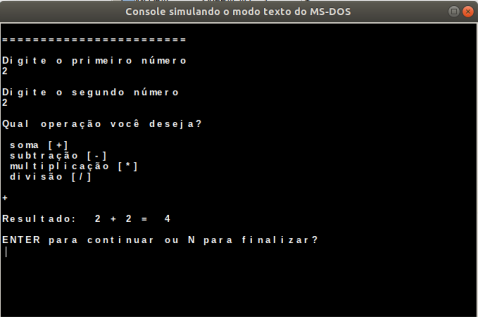

# Curso de Algoritmo

Os programas aqui foram desenvolvidos a partir do Curso de Lógica de Programação certificado pelo SENAI BA.

---

## Conteúdos abordados

- Calculadora
   - Variáveis
   - Atribuição
   - Se então senão
   - Repita

- Estrutura de Condição (se então senão)
- Função
- Repetição
- Vetor
- Estrutura de Repetição 
   - Para...Faça
   - Enquanto...Faça
   - Repita...até)
   - Função
   - Função (randi)
   
   ---
   

